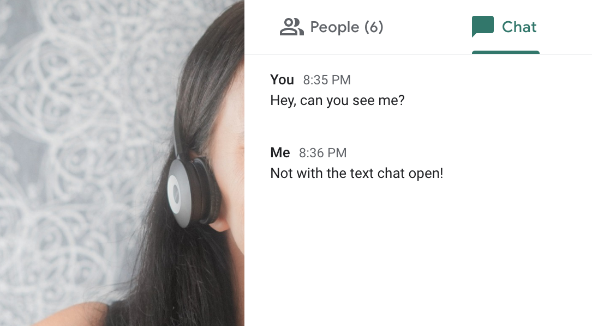
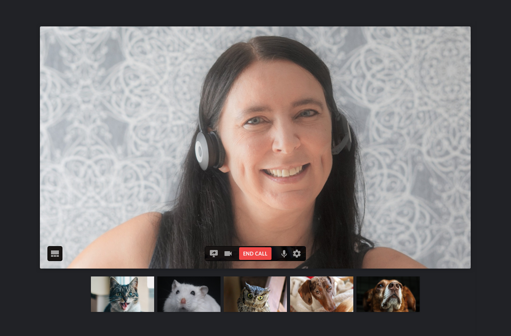

<!--
TODO:
- change date
- update heading texts
- add screenshots to items in "the list"
- proofread/edit/grammars
-->

**Note: If you are not familiar with Deaf and hard of hearing (DHH) culture, you may want to read [Deaf 101 by the Hearing, Speech & Deaf Center (HSDC)](https://www.hsdc.org/services/deaf-101/) first.**

## Introduction

Around mid-March, the COVID-19 pandemic started to really affect life here in Vancouver. Within the span of a few days, we went from business as usual to the shut-down of most of the city's public spaces.

This was a challenge for the ASL (American Sign Language) practice [Meetup](https://www.meetup.com/) I help organize, [ASL Social and Practice](https://www.meetup.com/ASL-Social/). Up until this point, we had been meeting in person at a public library. For the health and safety of our participants, and since more and more potential venues were shutting down anyway, we decided to look at whether it'd be feasible to move our Meetup online.

You might have expected that since sign languages are so visual, they would be well-suited for a visual format such as video. While video chat technology has made it possible to communicate in sign language online, it is no replacement for conversing in-person. Since ASL is a 3D language, certain aspects of the language cannot be preserved in a 2D format.

With this in mind, three of us from the ASL practice group tested out the following video chat apps:
- [Discord](https://discordapp.com/)
- [Google Hangouts](https://hangouts.google.com/)
- [Google Meet](https://meet.google.com/)
- [Houseparty](https://www.houseparty.com/)
- [Jitsi Meet](https://meet.jit.si/)
- [Skype](https://www.skype.com/)
- [Zoom](https://zoom.us/)

As expected, we did experience more difficulties communicating in sign language through video than in person. For example, it was tricky to get a particular person's attention, which we typically do by waving towards them and making eye contact. It's just not possible on video since there's no way to position ourselves in relation to others (unless everyone's got their own [MVPD](https://bigbangtheory.fandom.com/wiki/Mobile_Virtual_Presence_Device), that is).

While some issues were unavoidable due to the nature of the video format, there were additional difficulties stemming from the apps' designs. Like most things in the world, video chat apps were created for the hearing. If DHH been considered while designing the app, these issues would likely not exist.

<!-- TODO: work on this bit? -->
For the remainder of this blog post, I will list and describe UX patterns commonly found in video chat apps that make it more difficult to communicate without relying on audio. It is important to note that these issues were discovered during ASL practice with mostly hearing participants, and do not represent the DHH experience. At the same time, many of these design choices would have an impact on communicating with signing, lip reading, or when there's audio quality issues.

By the way, we ended up settling on Jitsi Meet for now, although Google Meet is quickly becoming a good contender with all the features they've started rolling out.

<!-- TODO: more descriptive heading...? -->
## UX patterns

### Screensharing disables video

In some video chat apps, when someone shares their screen, their camera is forced to be disabled. That means nobody in the video meeting can see the presenter. In some cases, the shared screen will take over the whole video meeting so it's impossible to see anyone's video.

**This design assumes that the presenter is speaking, and the audience is hearing.**

**What if the presenter were DHH?** The presenter cannot sign, since their camera is disabled. If there is an interpreter for a hearing audience, the interpreter would need to physically be with the presenter. The presenter may be able to communicate to their audience via text chat, but that means the presenter will have to go back and forth between their shared screen and the text chat.

**What if the audience were DHH?** They would not be able to watch the presenter for lip reading or signing, since their camera has been disabled. If everyone's cameras have been disabled, they would not be able see them for lip reading or signing, either. If the presenter is speaking, captions may be helpful.

### Text chat interface obstructs video

Pretty much all video chat applications also have a basic text chat feature participants can use to converse through text-based messages. This can be handy for sharing links, troubleshooting audio-video issues, and having side conversations. It's one of the tools DHH can use to communicate with the hearing. In our ASL practice Meetup, it's also been useful for explaining things when we are unable to get something across using sign language.

Unfortunately, in many cases, the text chat interface obstructs videos when in use. This makes it difficult, or even impossible, to see someone's reaction to messages. This kind of visual feedback can be critical to know if someone is understanding or responding to a message.

### Videos cropped differently

Video meeting apps will generally crop videos to lay out nicely. In some cases, the crop varies depending on the type of device it's displayed on. So, how someone sees themselves on their own device does not necessarily match what is shown to anyone else in the video chat.

This can have a huge impact on signing. If someone sees themselves on video with plenty of room around them, they would think they have all that room to use for signing. In actuality, their video could be cropped so much that only their face is visible, hiding their signing from others in the video chat.

<!--
  Combine next 2?
-->

### One large featured video

There are a few issues with this very common video layout, which displays one featured video at a large size. In some variants of this layout, the featured video is all that's visible. In others, everyone else's videos are shown at a much smaller size. In both cases, more videos could be shown on the screen if the featured video weren't so large.

#### Featuring video based on audio

Typically, the featured video is selected based on who is making the most noise. This works so-so for speaking-hearing conversations, since participants can see and listen to the current speaker. It still doesn't work that well when more than one person is speaking at a time, or if there's background noise. When communicating in sign language, focusing on the person that is making the most noise might swap out someone that is actively signing for someone that is only watching and happens to be making more noise.

#### Videos too small to see details

Video dimensions don't have much of an effect on speaking-hearing conversations, since there is no impact on audio quality. However, if the videos are too small to clearly see hand shapes and facial expressions, it can make signing and lip reading difficult or even impossible. The hearing equivalent could be muffling everyone's microphones except for the one featured person's.

#### Hiding more videos than necessary

With a large group video chat, it makes sense to limit the number of videos shown at a time so they don't display at tiny sizes. In this layout, though, more videos could fit on one screen at reasonable sizes if the featured video didn't take up so much room. While there is a balance to maintain, there is no way to lip read or receive signing from a hidden video. The hearing equivalent could be muting the microphones for all those with hidden videos.

### // TODO
<!-- TODO: edit next -->

### Video quality issues

<!--
  Get screenshot from Discord...?
-->

We've all been annoyed by video quality issues like freezing, lagging, blurring, and pixellation. These types of issues have a significant impact on non-auditory communication. While hearing-speaking conversations can still continue (so long as audio isn't also affected), lip reading and signing can be severely hampered. These types of issues can't all be fixed by the app, but some apps tend to have fewer issues than others.

### Captioning availability and quality

<!--
  Get screenshot from Jitsi...?
  - Some apps don't attribute captions to specific people (Google Meet is ok, try a diff one)? In this case, might not be able to tell who is speaking.
-->

Some video chat apps don't have a captioning feature at all. Many do now have captioning, but the captions quality can vary. Some apps will allow manual captioning, which is generally more accurate (and costly) than automatic captioning. Captions are beneficial for DHH observing a speaking presenter. In some cases, an interpreter may be more beneficial, especially if there is 2-way communication.

### Wishlist

#### Picture-in-picture for interpreter

#### Layout customizations

#### Feature the video that has the most movement.

#### Getting someone's attention

<!--
  Get screenshot... of what?
  TODO: expand this more...?
-->

There are [a number of ways to get a Deaf person's attention](https://www.lifeprint.com/asl101/topics/attention_getting_techniques.htm), and most of these don't work well in a video format. Flailing on video might get their attention, but they may be too focused on another video to notice, or they may not realize it's meant to grab their attention specifically. Pinging them through text chat might work. It would be nice if there were some way to highlight a video for specific people.

#### Referring to someone else

<!--
  Get screenshot... of what?
  TODO: expand this more...?
-->

When we refer to someone that is present in sign language, we can usually just point at them. In a video chat, pointing is pretty meaningless. There's no way to tell who someone is pointing at, especially if everyone's video order is different. We can adjust our communication style to use people's names, but many beginner's names can be a hassle to spell out.
