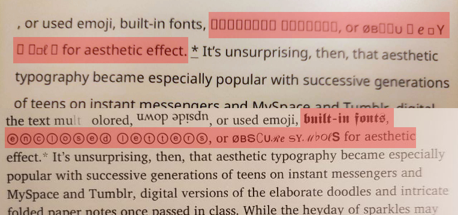

<!--
  TODO: Update frontmatter
-->

## Intro
- Recco view <https://twitter.com/shelbyspees>
- Name? eNote, ePaper, digital paper, e-ink tablet...
- Similarities: paper feel, e-ink display, limitations
- Final decision and why?
- Comparing: Supernote A5 X w/ base packages vs. reMarkable 2 w/ gray polymer weave book folio and marker plus
- Overall, prefer hardware of RM2 and software of A5X

## Comparison

### Price
- Bundling?
- reMarkable: starting at $517 USD for lowest model pen and cover (sleeve-style folio, not book folio). $597 USD for my bundle.
- Supernote: starting at $499 USD

### Hardware
- Both USB-C charging, size and weight similar
- reMarkable: sleek, prefer the gray bezel, more fragile?
- Supernote: cheaper feel, more resilient to falls? side bar functionality, glossier

### Software

#### OS (Operating System)
- Hackability?
- reMarkable: Linux
- Supernote: Android

#### Security
- reMarkable: their cloud
- Supernote: their cloud, dropbox, USB transfer, email*

#### Features
- Similarities? File transfer?
- reMarkable:
- Supernote: better ePub support, custom templates, custom fonts, recent files navigation, more colours, annotations, search handwritten notes, doesn't hide writing area, additional formats, kindle support, seems to get more features and updates, kindle

### Accessories

#### Pen

I opted for the [reMarkable 2's Marker Plus](https://remarkable.com/store/remarkable-2/markers), which has a digital eraser on the end for quick erasing. The Marker (not Marker Plus) is more comparable with the [Supernote's Standard Pen](https://www.supernote.com/#/part?id=SP-03) since neither of them have erasers.

The eraser end of the Marker Plus is convenient, but not necessary since it's still possible to erase by switching to the eraser tool through the user interface (UI). If this is an important feature to you, you could try the [LAMY AL-star EMR pen](https://www.supernote.com/#/part?id=SP-05) which has a side-button that activates the eraser tool.

Both pens are battery-less and don't require charging.

The Marker Plus attaches to the reMarkable 2 magnetically. I find this kind of gimmicky, but it is a bit quicker to access over the Supernote's Standard Pen, whose cap hooks onto the case's fabric pen loop. I'm not very confident in either attachment method - it feels like the pens could fall off by accident.

Supernote's Standard Pen feels heavier than the Marker Plus, and has been harder on my hands. It looks more like a regular pen, and has a removable cap. I dislike both of these design choices since I feel like I'll lose the cap and mix it up with a regular pen.

A unique feature of Supernote's Standard Pen is that it is nib-less and, according to Supernote, "never wears out". I was excited by the idea of never needing to buy replacement nibs until I found out that it's recommended to replace the ceramic core after "6 months of constant use".

I experimented with using the reMarkable's Marker Plus to write on the Supernote A5X, and found that the writing experience felt a lot more paper-like. I think the ceramic nib moves more smoothly, so it feels more like writing on a digital tablet.

Supernote has a few other pens available, but I think I'll try compatible third-party Electro-Magnetic Resonance (EMR) pens with quality nibs to use with the Supernote A5X for a more paper-like writing experience.

#### Cover

I opted for the [reMarkable 2's Book Folio with the grey polymer weave material](https://remarkable.com/store/remarkable-2/folios), which is pretty comparable to the [Supernote A5X's Canvas Folio](https://www.supernote.com/#/part?id=FC).

The reMarkable 2's Book Folio attaches to the device with magnets. As with the pen, it feels gimmicky and I'm not super confident about the attachment strength.

The Supernote A5X's Canvas Folio attaches to the device using a physical rail. The attachment feels pretty sturdy.

In terms of the material, I much prefer reMarkable's cover. It feels sturdier and the material feels like it's of a higher quality than Supernote's.

I wish that Supernote's pen loop were made from an elastic material so that different pens could fit snugly in it. As it is, the pen flops around quite a bit, and I'm not confident that the pen won't fall out of the cap which hooks over the fabric pen loop. Using an elasticated loop probably would've avoided [a problem Supernote had with pens they sold not being able to fit into the pen loop](https://supernote.com/#/blog/detail?id=97).

A major plus for me with the Supernote's cover is that it is a sleep cover. That is, the device is put to sleep when the cover is closed, and wakes when the cover is opened.

### Community and Support

reMarkable's website and social media are, much like their product, sleek. However, I found their support pretty unsubstantial. The community seems to be more technical people.

Supernote has active communities on Facebook and Reddit, which are frequented by Supernote employees that actually respond to posts! The community seems to be friendly. I do think their website and documentation aren't as good as reMarkable's, partly due to inaccessible coding and partly due to translation weirdness.
