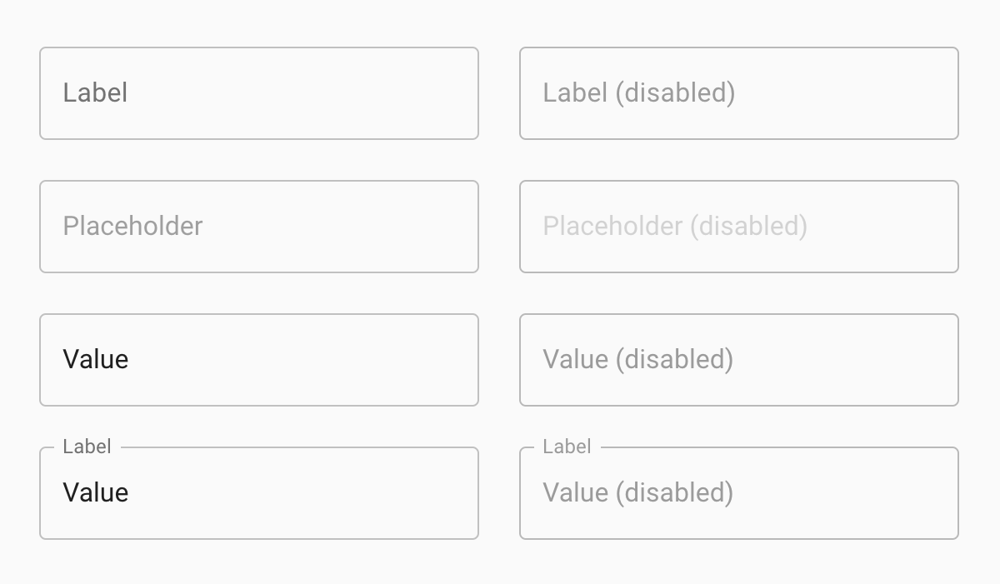
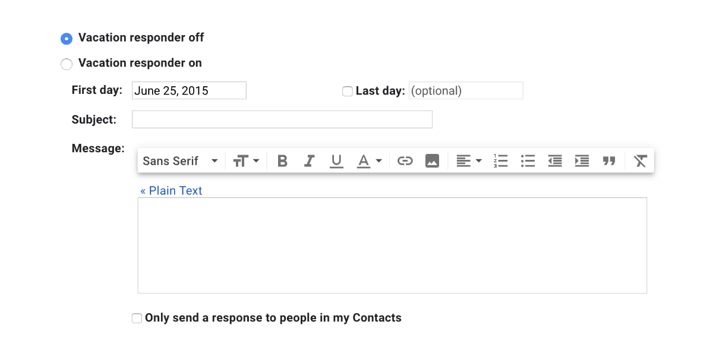

## Preface
I recently started working on a project built with [Google's Material Design UI library](https://material.io/), and noticed quite a few usability and accessibility issues. Most of these issues related to its form fields, particularly [its text fields](https://material.io/components/text-fields/). I shared some of these issues with my colleagues, and on Twitter ([Tweet 1](https://twitter.com/missmatsuko/status/1230564970800111617), [Tweet 2](https://twitter.com/missmatsuko/status/1231438167007354880)). Since I've discouraged the use of text fields like Material Design's many times before, I decided to make this post to share the next time it comes up.

**Note: Although it is common on the web, and is in some of the images below, you should never make visible form fields without a visible label.**

## What's wrong with Material Design text fields?
I'll go over the main issues I've found with Material Design text fields. Most of them are the same as with any field that uses "floating labels". Floating labels are labels that look like placeholders until interaction, when they then shrink and "float" up to look more like conventional labels. Nielsen Norman Group has [a great article you should read about why placeholders and floating labels in form fields are harmful](https://www.nngroup.com/articles/form-design-placeholders/). Some of these reasons will be mentioned again here.

### Different elements and states are styled similarly, or even identically

All the fields in the image above are configured differently. This is mainly communicated by using very slightly different shades of grey. The fields are practically indistinguishable. In fact, a few of the fields actually are styled identically. Labels, placeholders, and value text can all display as text within the field's outline. This makes it hard to tell whether a field is empty or not. Users will need to rely on additional clues, like content and interaction styles, before being able to determine the field's functionality.

### The label is inconsistent

There are many ways in which the label is inconsistent, and doesn't meet users' expectations.

The label can look like a value, placeholder, or (tiny) label, and it can be centered in the field or floated to its top left corner. It's hard to know exactly where to look for the field's actual label.

The label shrinks and moves, which can be especially distracting for users tabbing through a long form, and for users with some types of cognitive disabilities.

The label text shrinks to 75% of its size when the field is active or has a value. The small text size is hard to read, and would be especially frustrating for users who deliberately increased their text size for readability.

Unfortunately, the label can't easily be highlighted because of its positioning, and because it may move around when trying to highlight it. This makes it hard for users who want to select and copy the label, perhaps to look up its definition or a translation.

### The label is fragile
It's too easy to break the text field's design. Material Design's guidelines say "Label text shouldn’t take up multiple lines". That's just not realistic. We can't always control the label's character count, and we definitely can't expect every user to have the same font size.

Let's say we have a text field for "Work email address". Our Québécois French translator tells us the French label should be "Adresse de courrier électronique professionnelle". The English label fits just fine, but the French label is so long that it wraps to 3 lines and extends past the bottom of the text field's outline. When a value is entered into the fields, the value text overlaps the label, making it even harder to read.

The problem is worse for users who use custom styles to increase their font size. After resizing the text to 200%, both the English and French fields have overlapping text. This is a failure of [WCAG AA success criteria 1.4.4 - Resize Text]((https://www.w3.org/WAI/WCAG21/Understanding/resize-text.html)).

If we'd used a more conventional form field, we'd avoid this problem entirely. Here are text fields with the same labels as before, at default and 200% font sizes. The label is readable in all cases.

## But Google uses it!
So if Google jumped off a cliff, you would, too?

Really, though, this question is the most common response I get when I advise people not to use form fields like those in Google's Material Design UI library. They have a good point. Google is a huge company with extensive resources. They *should* be able to create user interfaces that are accessible, usable, and beautiful. I don't know what's going on over there in Google-land, but I'm guessing this kind of thing just isn't a priority for them. It's a shame that they've published a UI library with components like this, because so many others will use them and reference them for their own UIs.

They are making improvements though... I think. Material Design form fields used to stray even more from conventional form fields. Shown below is the old text field, which looks like underlined text, and the new text field we've been looking at in this article.

The text field designs were updated in 2017 after user testing, as reported in the Google Design blog post, [The Evolution of Material Design’s Text Fields](https://medium.com/google-design/the-evolution-of-material-designs-text-fields-603688b3fe03). The article doesn't give much detail about the alternative designs they tested, but I am fairly confident that conventional form fields would do better in user testing than their current design.

It's also interesting that Google doesn't use Material Design forms for all their forms. Although they do seem to be expanding its use, I've still mostly been seeing them on very small forms where it's pretty likely that the user already knows what kind of information they will need to provide.

One example where Google is using Material Design text fields is Gmail's login page. The log-in form actually only has a single field to start with, called "Email or phone". Users seeing this form probably got to this page intentionally, have logged in before, and are already expecting to enter their login credentials. All this makes it easier to complete the form, despite the the text field's design.

The settings page for Gmail, though, sticks to a much more conventional form design. And thank goodness because it would be such pain to fill out a long form containing a mix of blank and filled Material Design fields.

Here is just a small section of Gmail's settings form, which configures a vacation responder message. The form UI here is much more conventional, with bold, persistent labels and clearly outlined text inputs. So it seems that even Google doesn't find it appropriate to use their Material Design form fields for every situation.

## So what can I use?
As I've shown, you can't rely on UI libraries to get form fields right, even if they are popular and backed by giants. Most UI libraries, even browser native form fields, will allow options or combinations of options that you shouldn't use. You really need to become familiar with the characteristics of usable forms before using *any* UI library for them.

Learning about form usablility and accessibility will enable you to find suitable libraries, and know how to use them without harming usability and accessibility. It will also help if you end up creating your own UI, should you choose to go down that route.

[Adam Silver's book, Form Design Patterns](https://formdesignpatterns.com/), is a fantastic resource for learning all about usable forms. There's [an excerpt published on Smashing Magazine](https://www.smashingmagazine.com/2018/10/form-design-patterns-excerpt-a-registration-form/), in case you want to check that out before getting the book. I would say the overarching theme of the book is: make your form fields look like form fields. If they look and behave like browser native form fields, they're probably in better shape than these Material Design form fields.

[WebAIM's Creating Accessible Forms page](https://webaim.org/techniques/forms/) is a great place to learn more about the technical details of creating accessible forms.

## I don't have time for all that!
That's too bad, but I totally get that sometimes you are on a tight deadline and just can't do anything about it.

I highly encourage you to do the research when you're less swamped, but here are my top tips for the time being:
- **Don't** use placeholder text.
- **Don't** use disabled form fields and buttons, whenever possible.
- **Don't** make multi-column forms.
- **Do** make sure labels and instructions are always visible.
- **Do** put your labels and instructions above their fields.
- **Do** make sure your labels, inputs, and any help text are associated properly.
- **Do** make sure all text meets [WCAG colour contrast requirements](https://www.w3.org/TR/UNDERSTANDING-WCAG20/visual-audio-contrast-contrast.html).

<!-- TODO: Mention [Reakit](https://reakit.io/)? Other UI libraries? -->
