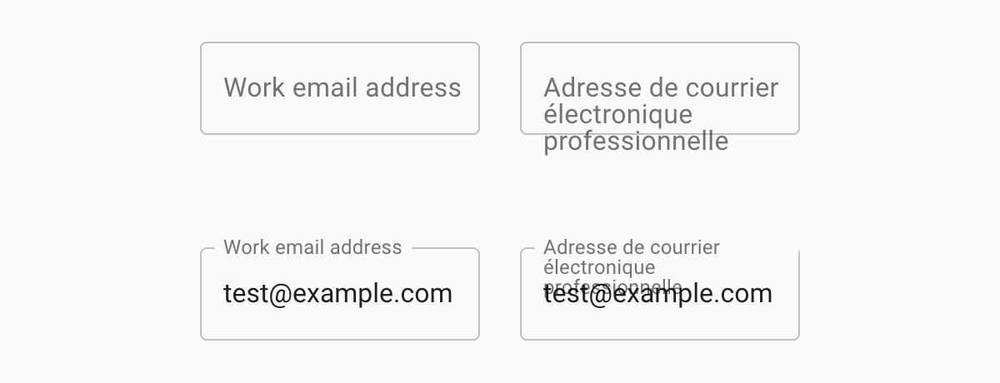
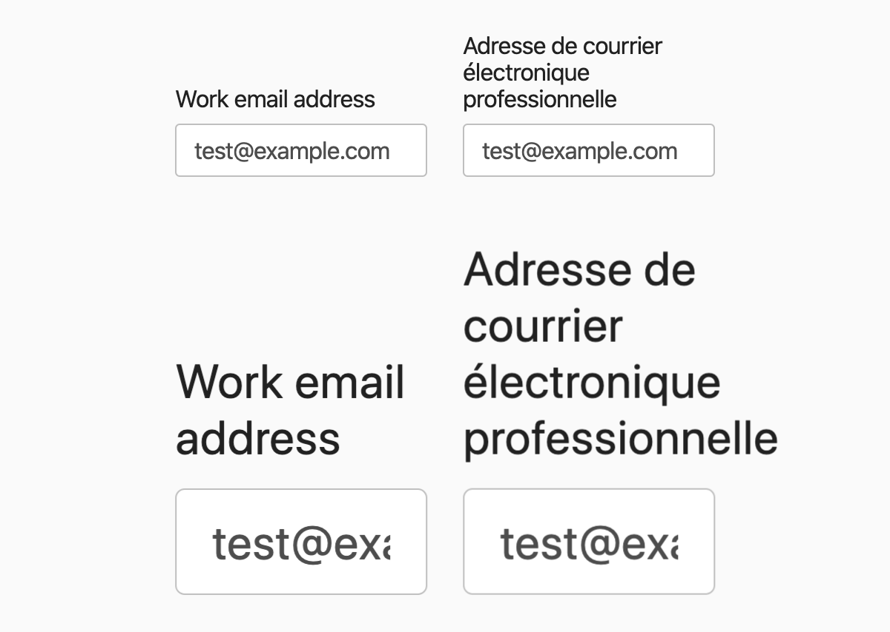
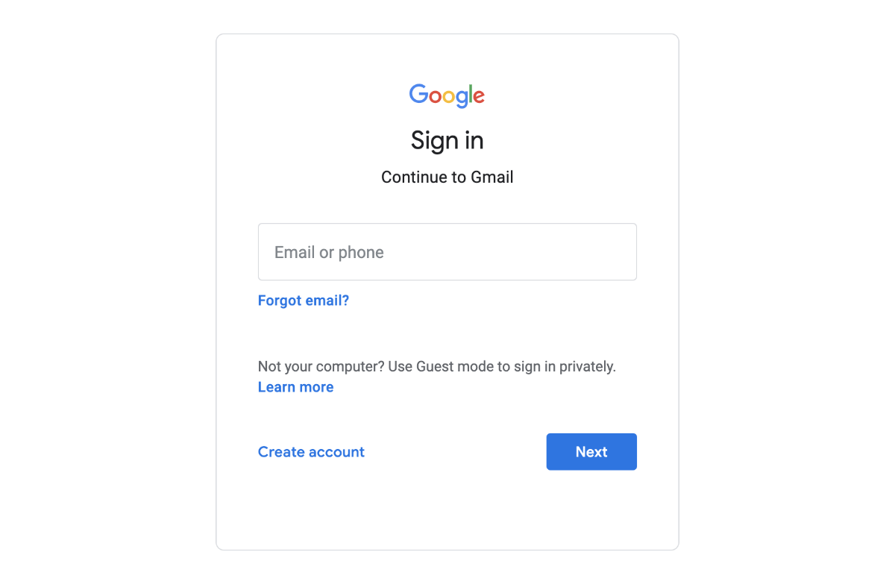

<!-- TODO: Update date? -->

## Preface
I've recently been working on an existing project built with [Google's Material Design UI Library](https://material.io/), where I noticed quite a few usability issues. Mostly of these issues were related to text fields. I shared some of these issues with my colleagues and on Twitter ([Tweet 1](https://twitter.com/missmatsuko/status/1230564970800111617), [Tweet 2](https://twitter.com/missmatsuko/status/1231438167007354880)). Since I felt like I've said this many times before, I've decided to make this post for me and anyone else to share whenever it comes up again (and I'm sure it will).

**Note: Although it is commonly seen on the web, and is shown in some of the images below, you should never make visible form fields without a visible label.**

## What's wrong with Material Design text fields?
I'll go over the main issues I've found with Material Design text fields. Most of them are the same as with any field that uses "floating labels". Floating labels are the style of labels that initially look like placeholders, then shrink and "float" up to look more like conventional form field labels. Nielsen Norman Group has [a great article about why placeholders and floating labels in form fields are harmful](https://www.nngroup.com/articles/form-design-placeholders/).

### Different elements and states are styled similarly, or even identically

All the fields in the image above are configured differently, but the difference is mainly communicated through slighty different shades of gray. They are practically indistinguishable. In fact, a few of the fields actually are styled identically. The user will need to rely on additional clues like content and interaction styles before they can determine the field's functionality.

Labels, placeholders, and value text can all display as text within the field's outline. This makes it hard to tell whether a field is empty or not.

### The label is inconsistent
The label can look like a value, placeholder, or (tiny) label. It's hard to know exactly where to look for the field's actual label.

The label moves around and shrinks with animation, which can be distracting. Especially so if you're tabbing through a bunch of fields in a long form or are perhaps a user with some types of cognitive disabilities.

The label text shrinks to 75% of its size when the field is active or has a value. This makes it harder to read and may especially be frustrating after you've deliberately set up your text to be larger.

A user might expect to be able to copy the label text. For example, to look up its definition or a translation. Some users, especially younger users, highlight text online as they read. The label can't easily be copied because of its positioning and because it could move around when you try to highlight it.

### The label is fragile
It's just too easy to break the text field's design. Material Design's guidelines say "Label text shouldn’t take up multiple lines", but we can't always control the length of the label's text, and we can't expect that the font size will be the same for every user.

Let's say we have a "Work email address" field. Our Québécois French translator tells us the French label should be "Adresse de courrier électronique professionnelle". The English label fits just fine, but the French one wraps to 3 lines and is extending past the bottom of the text field's outline! When a value is entered into the fields, the value text overlaps the label on the French field, making it even harder to read.

The problem is worse for some users, particularly those with low vision, who use custom styles to increase font size. Now we have the same problem for both languages!

If we'd used a more conventional form field, we'd avoid this problem entirely. Here are text fields with the same labels as before, at default and 200% font sizes. The label is readable in all cases!

## But Google uses it!
<!-- TODO: Break up this wall of text? -->
So if Google jumped off a cliff, you would, too?

Jokes aside, this is the most common responses I get when I advise people not to use form fields like those in Google's Material Design UI library. It's a good point, of course. Google is a huge company with extensive resources. They **should** be able to create user interfaces that are accessible, usable, and beautiful. I don't know what's going on over there in Google land, but I'm guessing this kind of thing just isn't a priority for them. It's a shame that they've published a UI library with components like this, because so many others will use them and reference them for their own UIs.

They are making improvements though... I think. Google's Material Design form fields used to stray even more from conventional form fields. It was updated in 2017 after user testing, as reported in their Google Design blog post, [The Evolution of Material Design’s Text Fields](https://medium.com/google-design/the-evolution-of-material-designs-text-fields-603688b3fe03). The article doesn't give much detail about the alternatives they tested, but I am confident that more conventional style form fields would do better in user testing than Material Design form fields.

Additionally, Google actually doesn't use Material Design forms for all their forms. Although they do seem to be expanding their use of Material Design style forms, I've still mostly been seeing them on very small forms where it's pretty likely that the user already knows what kind of information they will be entering into the form.

Google is using Material Design text fields on Gmail's login page. The log-in form actually only has a single field to start with: Email or phone. Users that are seeing this form probably got to this page intentionally, have logged in before, and are already expecting to enter their login credentials.

But if you look at what the settings page for Gmail looks like, it's a much more conventional form design. Here is just a small section of Gmail's settings form, which configures a vacation responder message. The form UI here is much more conventional, with bold, persistent labels and clearly outlined text inputs.

## So what can I use?
You really need to become familiar with the characteristics of usable forms before using *any* UI library for them.

As I've shown, you can't rely on UI libraries to get form fields right, even if they are popular and backed by giants. Additionally, most UI libraries, and even browser native form fields, will allow options or combinations of options that you shouldn't use.

Learning about usable form design and form accessibility will enable you to find libraries that work (maybe with a little tweaking), and know how to use them without harming usability and accessibility. It will also help if you end up creating your own UI, should you choose to go down that route.

[Adam Silver's book, Form Design Patterns](https://formdesignpatterns.com/), is a fantastic resource for learning all about usable forms. There's also [an excerpt published on Smashing Magazine](https://www.smashingmagazine.com/2018/10/form-design-patterns-excerpt-a-registration-form/), in case you want to check that out before getting the book. I would say the overarching theme is: make your form fields look like form fields. If they look and behave like browser native form fields, they're probably in better shape than Material Design form fields.

[WebAIM's Creating Accessible Forms page](https://webaim.org/techniques/forms/) is a great place to learn more about the technical details of creating accessible forms.

## I don't have time for all that!
That's too bad, but I totally get that sometimes you are on a tight deadline and just can't do anything about it.

I highly encourage you to do the research when you're less swamped, but here are my top tips for the time being:
- **Don't** use placeholder text.
- **Don't** use disabled form fields and buttons.
- **Don't** make multi-column forms.
- **Do** make sure labels and instructions are always visible.
- **Do** put your labels and instructions above their fields.
- **Do** make sure your labels, inputs, and any help text are associated properly.
- **Do** make sure all text meets WCAG colour contrast requirements.

<!-- TODO: Mention [Reakit](https://reakit.io/)? Other UI libraries? -->
